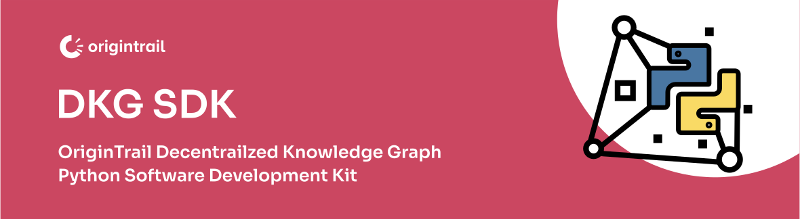

<a name="readme-top"></a>

> **Disclaimer: Beta Version**
>
> Welcome to the beta version of our client! This software is currently in the beta testing phase, which means it is not the final release version. As a beta version, it may still contain bugs, undergo frequent updates, and have limited features.
Important Points to Note:

> **Use at Your Own Risk:** While we have made efforts to ensure the stability and reliability of the beta version, there is a possibility of encountering unexpected issues. Please use this software at your own risk.

> **Limited Support:** As this is a beta release, our support resources may be focused on addressing critical bugs and gathering feedback from users. Therefore, support for beta versions may be limited compared to our stable releases.

> **Feedback Appreciated:** Your feedback is invaluable to us. If you encounter any issues, have suggestions, or want to share your experiences with the beta version, please let us know. Your feedback will help us improve the software for the final release.

> **Not for Production Use:** The beta version is intended for testing and evaluation purposes only. It is not recommended for use in a production environment where stability and reliability are crucial.

___

<br />
<div align="center">
  <a href="https://github.com/OriginTrail/dkg.py">
    
  </a>

  <h3 align="center"><b>dkg.py</b></h3>

  <p align="center">
    Python SDK for interacting with the OriginTrail Decentralized Knowledge Graph
    </br>
    <a href="https://docs.origintrail.io/">OriginTrail Docs</a>
    ·
    <a href="https://github.com/OriginTrail/dkg.py/examples/demo.py">View Demo</a>
    ·
    <a href="https://github.com/OriginTrail/dkg.py/issues">Report Bug</a>
    ·
    <a href="https://github.com/OriginTrail/dkg.py/issues">Request Feature</a>
  </p>
</div>

</br>

<details>
  <summary>
    <b>Table of Contents</b>
  </summary>
  <ol>
    <li>
      <a href="#📚-about-the-project">📚 About The Project</a>
      <ul>
        <li><a href="#what-is-a-decentralized-knowledge-graph">What is a Decentralized Knowledge Graph?</a></li>
        <li><a href="#the-origintrail-dkg-architecture">The OriginTrail DKG Architecture</a></li>
        <li><a href="#what-is-a-knowledge-asset">What is a Knowledge Asset?</a></li>
      </ul>
    </li>
    <li>
      <a href="#🚀-getting-started">🚀 Getting Started</a>
      <ul>
        <li><a href="#prerequisites">Prerequisites</a></li>
        <li><a href="#installation">Installation</a></li>
      </ul>
    </li>
    <li>
      <a href="#📜-roadmap">📜 Roadmap</a>
      <ul>
        <li><a href="#1️⃣-pre-development-phase">1️⃣ Pre-development Phase</a></li>
        <li><a href="#2️⃣-development-phase">2️⃣ Development Phase</a></li>
        <li><a href="#3️⃣-documentation-phase">3️⃣ Documentation Phase</a></li>
        <li><a href="#4️⃣-pre-release-phase">4️⃣ Pre-release Phase</a></li>
        <li><a href="#5️⃣-release">5️⃣ Release</a></li>
        <li><a href="#6️⃣-post-release">6️⃣ Post-release</a></li>
      </ul>
    </li>
    <li><a href="#📄-license">📄 License</a></li>
    <li><a href="#🤝-contributing">🤝 Contributing</a></li>
    <li><a href="#❤️-thanks-to-all-contributors">❤️ Contributors</a></li>
    <li><a href="#🌟-acknowledgements">🌟 Acknowledgements</a></li>
    <li><a href="#📰-social-media">📰 Social Media</a></li>
  </ol>
</details>

___

<br/>

## 📚 About The Project

<details>
<summary>

### <b>What is a Decentralized Knowledge Graph?</b>
</summary>

<br/>

<div align="center">
    
</div>

There are many available definitions of a knowledge graph, therefore we will present a simplified one focused on usability, rather than completeness. The purpose of this introduction is not to be a comprehensive guide for knowledge graphs, however it aims to get you started with the basics.

A **knowledge graph (KG)** is a network of entities — physical & digital objects, events or concepts — illustrating the relationship between them (aka a semantic network). KGs are used by major companies such as [Amazon](http://lunadong.com/talks/PG.pdf), [Google](https://en.wikipedia.org/wiki/Google_Knowledge_Graph), [Uber](https://www.youtube.com/watch?v=r3yMSl5NB_Q), [IBM](https://www.ibm.com/cloud/learn/knowledge-graph) etc for various applications: search, data integration, knowledge reasoning, recommendation engines, analytics, machine learning and AI etc.

Key characteristics of knowledge graphs:
* focus on data connections as "first class citizens" (linked data)
* designed to ingest data from multiple sources, usually in different formats
* flexible data model, easily extendable

Common knowledge graphs however are deployed within the domain of one organization and are designed to capture knowledge from various sources both from within and outside of the organization.

We define **decentralized knowledge graph (DKG)** as a global shared knowledge graph that is designed to benefit organizations and individuals by providing a common infrastructure for data exchange. The DKG:

* Enables Dapps with search, integration, analytics, AI and ML capabilities for any data source: blockchains, IPFS, enterprise systems, web services, personal devices
* Removes central authorities (decentralized infrastructure)
* Enables permissionless PUBLISH and QUERY (public network)
* Decentralized identity & Verifiable Credentials based access control (references private data)

</details>

<details>
<summary>

### <b>The OriginTrail DKG Architecture</b>
</summary>

<br/>

The OriginTrail Decentralized Network implements the DKG according to the OriginTrail protocol.

It is:

* **a permissionless network** - anyone can run OriginTrail nodes
* **a multi-chain data exchange network** - connects to several blockchains (currently Ethereum and xDai with more integrations upcoming such as with Polkadot)
* **designed for off-chain data exchange using standardized data models** (GS1 & W3C standards and recommendations)
* **public open source software**
* **infrastructure for knowledge marketplaces & tenders** - more info [here](https://www.youtube.com/watch?v=4uCxYGRh5fk)

More information is available on the OriginTrail [website](https://origintrail.io), [official documentation](https://docs.origintrail.io) and [blog](https://medium.com/origintrail).


</details>

<details>
<summary>

### <b>What is a Knowledge Asset?</b>
</summary>

<br/>

<div align="center">
    
</div>
</details>

<p align="right">(<a href="#readme-top">back to top</a>)</p>
<br/>

## 🚀 Getting Started

___

### Prerequisites

* python `>=3.11`
* poetry `>=1.5.1`

___
<br/>

### Installation


Create virtual environment (you can choose any existing folder this command will create configurations and virtual env for python):
```bash
python3 -m venv /path/to/folder
```

Inside of previously generated folder you will find activate script in bin folder and run it:
```bash
source /path/to/folder/bin/activate
```

Install dependencies:
```bash
poetry install
```

Now you can run a demo example file: 
```bash
python3 demo.py
```

<br/>
<p align="right">(<a href="#readme-top">back to top</a>)</p>

## 📜 Roadmap

This roadmap outlines the goals for the first major release of the `dkg.py`. Each section represents a stage in the development process and the features we plan to implement.

<details>
<summary>

### ~~1️⃣ Pre-development Phase~~

</summary>

- [x] **Requirement Analysis and Planning**
  - [x] Define the project's scope
  - [x] Identify the core functionalities

- [x] **Design**
  - [x] Plan the library's architecture
  - [x] Establish coding standards

- [ ] **Setup Development Environment**
  - [x] Setup development, testing and production environments
  - [ ] Add pytest config
  - [ ] Add mypy config
  - [ ] Add tox config ?
  - [ ] Setup Continuous Integration (CI) and Continuous Deployment (CD) pipeline
</details>

<details>
<summary>

### 2️⃣ Development Phase
</summary>

| Feature | Status | Tests coverage |
|:-:|:-:|:-:|
| Create | 🟩 Completed | ❌ |
| Transfer | 🟩 Completed | ❌ |
| Update | 🟩 Completed | ❌ |
| Wait for finalization | 🟥 Not Started | ❌ |
| Cancel update | 🟩 Completed | ❌ |
| Burn | 🟩 Completed | ❌ |
| Get | 🟩 Completed | ❌ |
| Query | 🟩 Completed | ❌ |
| Extend storing period | 🟩 Completed | ❌ |
| Add tokens | 🟩 Completed | ❌ |
| Add update tokens | 🟩 Completed | ❌ |
| Get owner | 🟩 Completed | ❌ |
| Experimental | 🟥 Not Started | ❌ |
</details>

<details>
<summary>

### 3️⃣ Documentation Phase
</summary>

- [ ] Write comprehensive documentation
- [x] Provide examples and use-cases
- [ ] Review and finalize documentation
</details>

<details>
<summary>

### 4️⃣ Pre-release Phase
</summary>

- [ ] **Beta Release**
  - [X] Release a beta version for testing
  - [ ] Gather and address feedback

- **Bug Fixes**
  - Identify and fix bugs

- [ ] **Final Testing and QA**
  - [ ] Perform comprehensive testing
  - [ ] Ensure the library meets quality standards
</details>

<details>
<summary>

### 5️⃣ Release
</summary>

- [ ] Merge the first version into the main branch
- [ ] Release the v1.0.0 of the `dkg.py` library
</details>

<details>
<summary>

### 6️⃣ Post-release
</summary>

- Monitor for any issues
- Plan for next versions based on user feedback and usage
</details>

<br/>

**Note:** This roadmap is subject to changes. Each step will be accompanied by appropriate documentation, testing and code review to maintain the quality of the library.

<br/>
<p align="right">(<a href="#readme-top">back to top</a>)</p>

## 📄 License

Distributed under the MIT License. See `LICENSE` file for more information.

<br/>
<p align="right">(<a href="#readme-top">back to top</a>)</p>

## 🤝 Contributing

Contributions are what make the open source community such an amazing place to learn, inspire, and create. Any contributions you make are **greatly appreciated**.

If you have a suggestion that would make this better, please fork the repo and create a pull request. You can also simply open an issue with the tag "enhancement".
Don't forget to give the project a star! Thanks again!

1. Fork the Project
2. Create your Feature Branch (`git checkout -b feature/AmazingFeature`)
3. Commit your Changes (`git commit -m 'Add some AmazingFeature'`)
4. Push to the Branch (`git push origin feature/AmazingFeature`)
5. Open a Pull Request

<br/>
<p align="right">(<a href="#readme-top">back to top</a>)</p>

## ❤️ Thanks to all Contributors!

<!-- readme: <u.hubar>,collaborators,<mucke12>,contributors/- -start -->
<!-- readme: <u.hubar>,collaborators,<mucke12>,contributors/- -end -->

<br/>
<p align="right">(<a href="#readme-top">back to top</a>)</p>

## 🌟 Acknowledgements

- [web3.py](https://github.com/ethereum/web3.py): Basis for this project


<br/>
<p align="right">(<a href="#readme-top">back to top</a>)</p>

## 📰 Social Media

<br/>

<div align="center">
  <a href="https://medium.com/origintrail">
    
  </a>
  <a href="https://t.me/origintrail">
    
  </a>
  <a href="https://x.com/origin_trail">
    
  </a>
  <a href="https://www.youtube.com/c/origintrail">
    
  </a>
  <a href="https://www.linkedin.com/company/origintrail/">
    
  </a>
  <a href="https://discord.gg/cCRPzzmnNT">
    
  </a>
  <a href="https://www.reddit.com/r/OriginTrail/">
    
  </a>
  <a href="https://coinmarketcap.com/currencies/origintrail/">
    
  </a>
</div>

___
